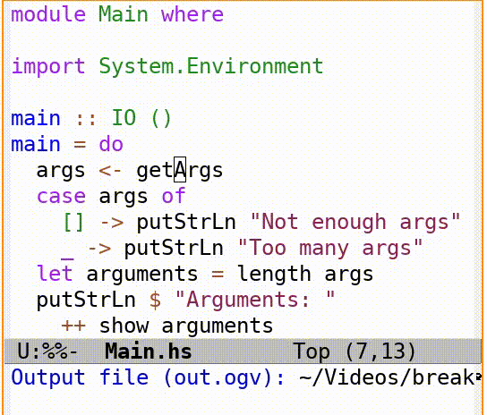
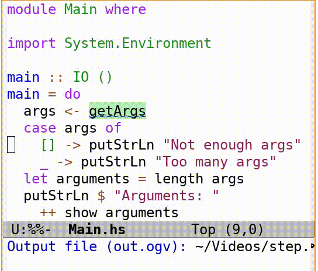

# GHCi debugging integration for Emacs

This package provides integration of the Haskell GHCi debugger into Emacs.

It's still very rough and keeps breaking. But it's still a huge improvement over
the raw GHCi debugger.

## Features

### Toggle breakpoints

## Step through execution

## Usage

To enable debug mode run `M-x intero-debug-mode`.

Defined keys in intero-debug-mode:

* `b` - toggle breakpoints at point
* `<SPC>` - Take a single step
* `g` - refresh display and go to current context
* `a` - abandon the current computation
* `q` - quit intero-debug-mode

The mode will start automatically when GHCi stops at a breakpoint and `intero-debug-auto-start-debug-mode` is set.

You can customize the behaviour and appearance with `M-x customize-group <RET> intero-debug`
